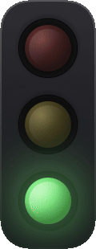

# Codex Traffic Light

[English](README.md)

适用于 **Codex Desktop** 的 macOS 交通灯状态提示器。它把 Codex 的工作状态显示在菜单栏与可拖动的悬浮灯中，让你无需一直盯着对话窗口。



## 状态映射

| 灯色 | Codex 状态 |
| --- | --- |
| 🔴 红灯 | 正在思考、执行命令或编辑文件 |
| 🟡 黄灯 | 正在等待你回答问题，或等待退出计划模式 |
| 🟢 绿灯 | 当前任务已停止或完成 |

状态只通过本机 `127.0.0.1` 的 Hooks 传递；Lights 不读取聊天内容，也不会把状态发送到外部网络。

## 功能

- 常驻菜单栏交通灯，可选显示桌面悬浮灯。
- 悬浮灯支持拖动、横向/纵向布局，以及独立的 5 档大小。
- 状态栏交通灯也有独立的 5 档大小与黑色/透明背景。
- 任务完成后，绿灯可设置不闪烁、闪 1/3/5/10 次，并可选择 0.3、0.5、0.8、1.2 或 1.6 秒的闪烁间隔。
- 菜单和配置面板支持中文、English。
- `Setup Hooks…` 中提供 Codex Desktop 一键配置：自动备份并写入所需 Hooks，完成后明确提示重启 Codex。
- 支持“登录时启动 Lights”。

## 使用

1. 打开 `Lights.app`。
2. 点击菜单栏图标或右键悬浮灯，选择 `Setup Hooks…`。
3. 在 **Codex Desktop** 一栏点击 `Configure / 配置`。
4. 看到“已配置，请重启 Codex 生效”后，重启 Codex Desktop 并信任 Hooks。

常用设置在菜单中可直接调整：

- `Show Light / 显示悬浮灯`
- `Size / 大小` → 分别设置悬浮灯和状态栏
- `Layout / 布局`
- `Status Bar Background / 状态栏背景`
- `Green Light Alert / 绿灯提醒`
- `Launch Lights at Login / 登录时启动 Lights`
- `Language / 语言`

## 本地构建

环境要求：macOS 14+、Swift 5.9+ 与 Xcode Command Line Tools。

```bash
swift build -c release --arch arm64
./build-app.sh
open Lights.app
```

`build-app.sh` 会生成 `Lights.app`。如需发布签名或公证，可使用仓库中的 `release-app.sh` 与 `notarize.sh`。

## 致谢与许可

本项目基于 [fengyiqicoder/Lights](https://github.com/fengyiqicoder/Lights) 的开源架构进行面向 Codex Desktop 的定制与扩展，感谢原项目提供的基础。

本项目采用 [MIT License](LICENSE)。
